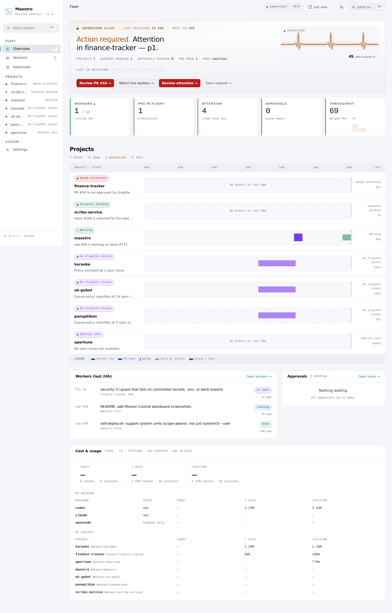
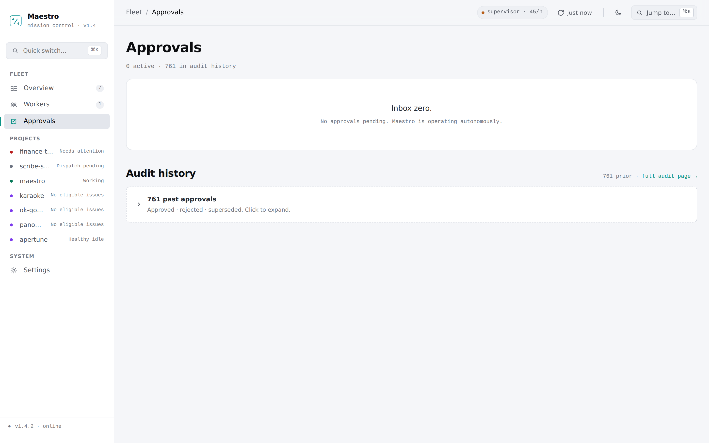
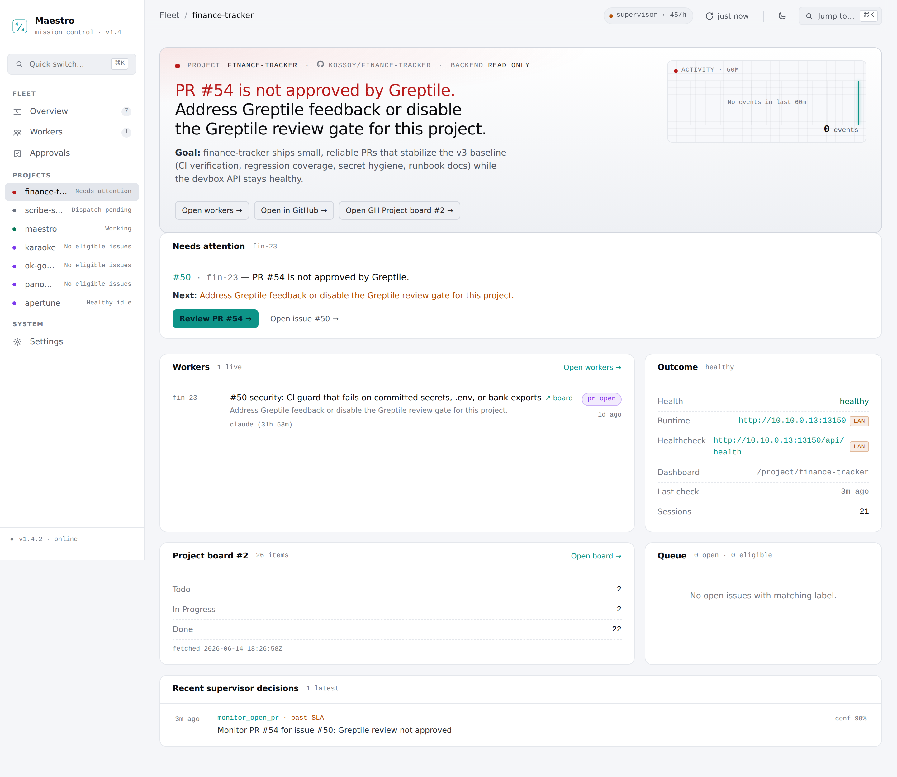
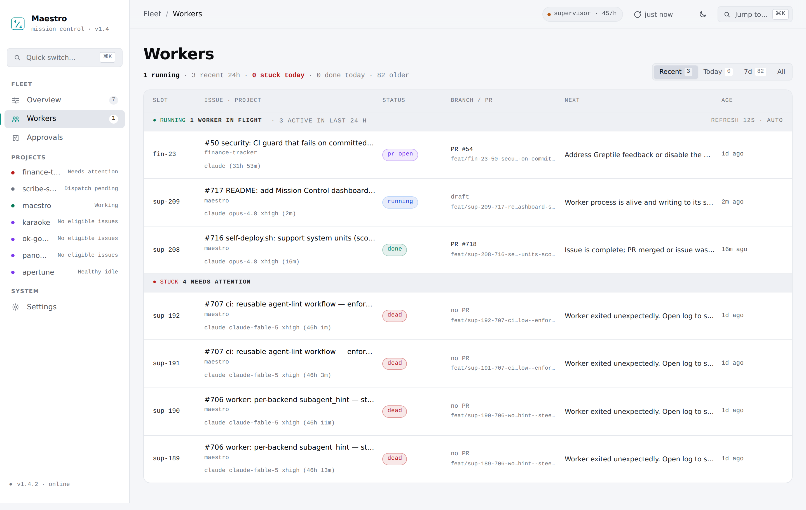

# maestro

A Go-based agent orchestrator for managing parallel AI coding agents working on GitHub issues.

Replaces the previous `ao` (agent-orchestrator npm package) + shell scripts setup with a proper Go daemon.

## What it does

maestro orchestrates multiple parallel AI coding agents (Claude, Codex, Gemini, Cline), each working on a separate GitHub issue in its own git worktree. It:

- Picks open GitHub issues matching a label (e.g. `enhancement`)
- Creates git worktrees for each agent
- Spawns the configured backend CLI (e.g. `claude`, `codex`, `gemini`, or `cline`) in each worktree with a task prompt
- Monitors agent progress (process alive? PR created? CI green?)
- Auto-merges PRs when CI passes
- Rebases PRs that have merge conflicts
- Notifies you via Telegram (through OpenClaw gateway) on important events
- Cleans up dead/stale sessions

## Mission Control

Mission Control (MC) is the fleet web dashboard maestro serves at `http://127.0.0.1:8786`. It's how an operator watches every project, worker, and approval at a glance.



*Fleet overview (`/`) — the operator brief: hero next-action, fleet KPIs, the per-project health grid, recent workers, and cost/usage.*



*Approvals (`/approvals`) — the cautious-gate write-path: pending approvals to approve/reject, with the full audit history below.*



*Project view (`/project/<name>`) — single-project drill-down: attention/next-action, live workers, health, independent orchestrator/supervisor/watchdog cadences, stalled-progress contract/deadline/recommendation state, project board, and recent supervisor decisions.*



*Workers (`/workers`) — every worker across the fleet with status, branch/PR, and next step.*

> Screenshots are captured from a live MC instance with [`scripts/capture-mc-screenshots.mjs`](scripts/capture-mc-screenshots.mjs). To refresh them, run `bun scripts/capture-mc-screenshots.mjs` on the host serving MC (override the target with `MC_BASE_URL`).

## Prerequisites

### Required
- **`git`** — pre-installed on most systems
- **`gh`** (GitHub CLI) — [cli.github.com](https://cli.github.com)
- **`tmux`** — required for worker session management
- **One of the following AI CLIs:**

| CLI | Provider | Install |
|-----|----------|---------|
| `claude` | Anthropic Claude Code | [claude.ai/code](https://claude.ai/code) |
| `codex` | OpenAI Codex | `bun add -g @openai/codex` |
| `gemini` | Google Gemini | `npm i -g @google/gemini-cli` |
| `cline` | Cline (OpenAI-compatible providers) | `bun add -g cline` |

You only need one — whichever you have access to.

### Optional for Go repositories
- **`gopls`** — enables symbol-aware pre-worker research context for Go modules (`go install golang.org/x/tools/gopls@latest`)

### Verify prerequisites
```bash
git --version        # any recent version
gh --version         # 2.x+
tmux -V              # any recent version
claude --version     # or: codex --version / gemini --version / cline --version
gopls version        # optional; used for Go symbol context when available
```

### Setup
```bash
# Authenticate GitHub CLI
gh auth login

# Verify access to your target repo
gh auth status

# Authenticate/configure your chosen AI CLI (example for Claude):
claude auth   # or codex auth / gemini auth
# For Cline: configure provider + model in ~/.cline/data/globalState.json and secrets.json
```

### Private repositories
Maestro works with private repos — all GitHub operations go through `gh` CLI. As long as `gh auth status` shows access to the repo, maestro works.

## Installation

### Quick install

```bash
curl -fsSL https://raw.githubusercontent.com/BeFeast/maestro/main/install.sh | sh
```

`install.sh` downloads the latest release tarball for your OS/arch (`maestro-<os>-<arch>.tar.gz`), extracts the binary, and installs it to `/usr/local/bin/maestro` (uses `sudo` only if needed).

To install somewhere else:

```bash
INSTALL_DIR="$HOME/.local/bin" curl -fsSL https://raw.githubusercontent.com/BeFeast/maestro/main/install.sh | sh
```

### Build from source

Requires Go 1.22+.

```bash
git clone https://github.com/BeFeast/maestro
cd maestro
VERSION="$(sed -nE 's/^version[[:space:]]*=[[:space:]]*"([^"]+)".*/\1/p' VERSION)"
test -n "$VERSION"
go build -trimpath -ldflags "-X main.version=${VERSION}" ./cmd/maestro/
sudo mv maestro /usr/local/bin/  # or add to PATH
```

## Quickstart

Maestro runs as **one long-lived daemon** reading a shared SQLite config store:
`maestro daemon --watch-store`. Each project is a single row in that store — there
is no per-project service. The retired `maestro init` wizard (which scaffolded a
per-project `maestro.yaml` + systemd/launchd unit) is gone; add projects with the
`project plan`/`project apply` genesis flow instead.

```bash
# 1. Install maestro
curl -fsSL https://raw.githubusercontent.com/BeFeast/maestro/main/install.sh | sh
maestro version   # verify installation

# 2. Choose absolute execution-host paths and create the Management Home Area.
REPO_PATH="$HOME/src/myrepo"
WORKTREE_BASE="$HOME/.worktrees/myrepo"
MANAGEMENT_HOME="$HOME/Obsidian Vault/Dev/Areas/myrepo"
PROJECT_ID="$(uuidgen | tr '[:upper:]' '[:lower:]')"
gh repo clone owner/myrepo "$REPO_PATH"   # omit when it is already cloned
mkdir -p "$WORKTREE_BASE" "$MANAGEMENT_HOME"

# 3. Write a portable project config (repo, local paths, and a stable project_id).
#    Generate the UUID once and keep it: it is the durable identity apply confirms.
cat > "$HOME/myrepo.project.yaml" <<YAML
repo: owner/myrepo
local_path: ${REPO_PATH}
worktree_base: ${WORKTREE_BASE}
project_id: ${PROJECT_ID}
management_home:
  kind: obsidian
  path: ${MANAGEMENT_HOME}
  vault: Obsidian Vault
  vault_path: Dev/Areas/myrepo
max_parallel: 3
issue_labels:
  - enhancement
model:
  default: claude
YAML

# 4. In a second terminal, start the one fleet daemon. Keep this process running;
#    for a persistent Linux user service, see "Running as a Service" below.
mkdir -p ~/.maestro
maestro daemon --watch-store --store ~/.maestro/maestro.db \
  --approvals-store sqlite --state-store sqlite

# 5. Preview the effect on the config store — strictly validated, zero writes.
#    Point --db at the same store the daemon unit reads (its --store path):
maestro project plan  --file ~/myrepo.project.yaml --db ~/.maestro/maestro.db --json

# 6. Apply the exact command in plan receipt `next[0]` — it pins identity,
#    desired config fingerprint, and observed store baseline:
maestro project apply --file ~/myrepo.project.yaml --db ~/.maestro/maestro.db \
    --confirm "$PROJECT_ID" \
    --fingerprint <sha256-from-plan> --baseline <baseline-from-plan> --json
```

`plan` never writes; `apply` upserts exactly one row (a second identical apply is a
reported no-op, and an identity conflict is a hard stop that never overwrites by
name). The running `maestro daemon --watch-store` observes the new row within one
poll interval and starts one flow — no restart, no `systemctl enable` per project.
Removing a project stays a separate explicit operator action (`maestro config-store
rm <name>`).

```bash
# The daemon already serves the fleet Mission Control and API; do not start a
# separate `maestro serve` process for the same fleet.
curl -fsS http://127.0.0.1:8786/api/v1/fleet
# Open http://127.0.0.1:8786/ in a browser.
```

That's it. Maestro will now pick up issues matching your configured label, spawn AI agents in isolated worktrees, and auto-merge PRs when CI passes.

To manually spawn a worker for a specific issue:
```bash
maestro spawn --config-store ~/.maestro/maestro.db \
  --config-store-project owner-myrepo --issue 42
```

Use the Mission Control already served by the daemon at
`http://127.0.0.1:8786/`; do not start a second `maestro serve` process.

The dashboard now boots **write-enabled by default** (trusted-LAN posture, #477). The cautious approval gate still guards the four mutating verbs — `merge_pr`, `close_issue`, `delete_worktree`, and `change_global_config` — so even a writable HTTP caller cannot bypass operator approval. For installs exposed beyond a trusted LAN, run with `--read-only=true` (or set `server.read_only: true` in YAML) and configure the optional HTTP auth layer (#616, off by default).

For multi-project Fleet Mission Control operations, see [`docs/fleet-mission-control-runbook.md`](docs/fleet-mission-control-runbook.md).

To flip fleet-wide or per-project cost/LLM knobs (`supervisor.enabled`, backends, token budgets) with hot reload and an audit trail, see [`docs/fleet-settings-runbook.md`](docs/fleet-settings-runbook.md).

### Dashboard auth posture: trusted LAN vs. exposed

Maestro's dashboard auth is opt-in and disabled by default. The right posture depends on where the port is reachable from:

- **Trusted LAN (default).** When the daemon is bound to `127.0.0.1` or a network only operators can reach, leave `server.auth` empty. The cautious approval gate still protects `merge_pr`, `close_issue`, `delete_worktree`, and `change_global_config`.
- **Exposed / shared network.** When the daemon uses `--host 0.0.0.0`, sits behind a reverse proxy, or runs on a multi-tenant host, set `server.auth.token_env` in a project row (the fleet derives one shared auth policy) or start the daemon with `--read-only=true`. With auth enabled, **every** endpoint (read GETs, write POSTs, and the SPA HTML) rejects unauthenticated requests with `401`; the cautious approval gate still fires for authenticated callers as defense in depth.

The token is loaded at runtime from an environment variable populated by your secret manager (Infisical, 1Password CLI, etc.) — never hardcoded in YAML:

```yaml
server:
  auth:
    token_env: MAESTRO_DASHBOARD_TOKEN   # env var name; populate from your secret manager
    actor_name: dashboard-operator       # optional; audit actor recorded for authed requests
```

When `auth.token_env` resolves to a non-empty value, every request — `GET /api/v1/...`, `POST /api/v1/...` (`/actions`, `/approvals/{id}/{approve|reject}`, `/audit/log`, `/refresh`), and the dashboard HTML / static assets — requires a credential and returns `401` otherwise. Two authentication schemes are accepted (the server advertises both in the `WWW-Authenticate` challenge):

- **HTTP Basic** — any username, password equal to the token. Browsers prompt natively, then cache the credential for the realm so subsequent SPA fetches authenticate automatically.
- **Bearer token** — `Authorization: Bearer <token>`. Use this for `curl`, scripts, and clients driven directly by a secret manager.

The authenticated identity replaces any `actor` field in the request body — operators cannot impersonate one another even if they share the token.

To watch workers live in a tmux dashboard:
```bash
maestro watch
```

## Project Row Configuration

The following is a configuration reference. For a new project, keep the
portable YAML outside the code repo and register it through `project plan` /
`project apply`; the running daemon reads the resulting row, not this file.

```yaml
repo: OWNER/REPO
local_path: /path/to/local/clone
worktree_base: /path/to/worktrees/repo
project_id: 3f2504e0-4f89-41d3-9a0c-0305e82c3301
management_home:
  kind: obsidian
  path: /absolute/path/to/Obsidian Vault/Dev/Areas/project
  vault: Obsidian Vault
  vault_path: Dev/Areas/project
max_parallel: 5
max_runtime_minutes: 120           # hard timeout per worker (default: 120)
stalled_progress_watchdog:         # explicit opt-in multi-signal evaluator
  enabled: true
  max_silence_minutes: 20          # exact-lease worker recovery; runtime-live contract remains canary-gated
  eval_interval_seconds: 60        # independent local evaluation cadence
worker_max_tokens: 0               # kill worker when cumulative token usage exceeds this (0 = unlimited)
auto_rebase: true                  # auto-rebase conflicting PR branches (default: true)
merge_strategy: sequential         # "sequential" (default) or "parallel"
merge_interval_seconds: 30         # minimum seconds between merges in sequential mode
review_gate: greptile              # "greptile" (default) or "none"
review_retrigger:                  # self-heal greptile webhook misses (#691)
  enabled: true                    # post "@greptile review" when the gate wedges at pending (default: true)
  pending_minutes: 10              # re-trigger after this long pending on one head SHA (default: 10)
  cooldown_minutes: 30             # minimum gap between re-trigger comments (default: 30)
auto_retry_review_feedback: false  # retry PRs with actionable review comments
auto_retry_rebase_conflicts: false # retry PRs whose auto-rebase fails with conflicts
session_prefix: prj                # worker session name prefix (default: first 3 chars of repo name)
state_dir: ~/.maestro/<project>    # state/log directory (default: ~/.maestro/<repo-hash>)
claude_cmd: claude                 # deprecated: use model.backends.claude.cmd
server:
  auth:
    token_env: MAESTRO_DASHBOARD_TOKEN  # optional shared fleet auth; secret value stays in the environment
issue_labels:                      # preferred label filter (OR semantics)
  - enhancement
exclude_labels:
  - blocked
telegram:
  target: "YOUR_TELEGRAM_CHAT_ID" # Telegram user ID
  openclaw_url: "http://localhost:18789"  # OpenClaw gateway
```

`issue_label` is still supported for backward compatibility, but `issue_labels` is recommended for new configs.

For the explicit, default-off SSH worker spike, including runner provisioning,
short-lived credential handling, measurements, rollback, and exact zombie
cleanup, see the [remote worker runbook](docs/remote-runner-spike.md).

## AI Backends

Maestro supports multiple AI coding agents. Configure via `model:` in `maestro.yaml`:

```yaml
model:
  default: claude        # which backend to use by default
  backends:
    claude:
      cmd: claude        # Anthropic Claude Code CLI
    codex:
      cmd: codex         # OpenAI Codex CLI
    gemini:
      cmd: gemini        # Google Gemini CLI
    cline:
      cmd: cline         # Cline CLI (e.g. SAP AI Core / any OpenAI-compatible provider)
```

### Supported backends

> [!NOTE]
> **Claude** (default) — Anthropic Claude Code CLI
> Install: https://claude.ai/code | `claude --version`

> [!NOTE]
> **OpenAI Codex** — OpenAI Codex CLI
> Install: `npm install -g @openai/codex` or `bun add -g @openai/codex`
> Auth: `codex auth` or set `OPENAI_API_KEY`

> [!NOTE]
> **Gemini** — Google Gemini CLI
> Install: `npm install -g @google/gemini-cli`
> Auth: `gemini auth` or set `GEMINI_API_KEY`

> [!NOTE]
> **Cline** — Cline CLI, supports any OpenAI-compatible provider (including SAP AI Core, Azure OpenAI, etc.)
> Install: `bun add -g cline` | `cline --version`
> Config: `~/.cline/data/globalState.json` + `secrets.json` — configure provider and model before use.
> Headless mode: `cline -y "task"` — auto-approves all actions and exits when done.
> SAP AI Core example: set provider to `sapaicore`, model to `anthropic--claude-4.5-opus`.

### Custom-named backends

Backends do not have to be named after the CLI they run. A custom key (e.g. a model nickname) keeps full CLI-specific behaviour — permission-bypass flags and stdin prompt delivery — as long as Maestro can tell which CLI it wraps. Resolution order:

1. the backend name itself (`claude`, `codex`, `gemini`, `cline`),
2. the `provider` field (`anthropic`/`claude` → Claude, `openai`/`codex` → Codex, `google`/`gemini` → Gemini, `cline` → Cline),
3. the binary basename of `cmd` (`claude`, `codex`, `gemini`, `cline`).

```yaml
model:
  default: fable
  backends:
    fable:
      provider: anthropic    # → claude exec path (--dangerously-skip-permissions, -p, prompt via stdin)
      cmd: claude --model claude-fable-5 --effort xhigh
    fast:
      provider: openai       # → codex exec path (exec, bypass flag, prompt via stdin)
      cmd: codex --profile fast
```

A backend that matches none of the above falls back to the generic exec path: `prompt_mode` applies, no permission-bypass flag is added, and Maestro logs a startup warning naming the backend. Use the generic path only for genuinely custom CLIs.

### Claude / Codex usage capture (tokens + cost)

Plain `claude -p` text mode prints no parseable token total, and `codex exec` text mode only prints a fuzzy single total — so a worker's `tokens_used_total` and USD cost are unreliable or `0`. Opt a `claude` or `codex` backend into structured usage capture with `usage_stream: true`:

```yaml
model:
  default: claude
  backends:
    claude:
      cmd: claude
      usage_stream: true   # run claude in --output-format stream-json; capture tokens + cost
    codex:
      cmd: codex
      usage_stream: true   # run codex exec --json; capture split tokens (cost = virtual)
      pricing:
        input_usd_per_mtok: 1.25
        output_usd_per_mtok: 10
```

When enabled, the worker runs the backend in structured-stream mode (`claude --output-format stream-json --verbose`, or `codex exec --json`) and its NDJSON is piped through `maestro stream-split`, which writes the raw frames to a side-channel `<slot>.jsonl` (parsed for `input`/`output`/cache tokens) while keeping `<slot>.log` human-readable. The session then reports non-zero split tokens in `maestro history --json` and the `/api/v1/fleet` cost panel. Off by default; an operator-pinned `--output-format` (claude) or `--json` (codex) in `extra_args` overrides it. Claude reports its own `total_cost_usd`; codex does not, so its cost is **virtual** — computed from the configured `pricing` block (tokens-only `$0` when no rates are set). (The `pi` backend captures usage natively and needs no opt-in.)

#### Claude harness through CLIProxyAPI: non-Anthropic telemetry smoke (2026-07-21)

Claude Code 2.1.216 was exercised in the same structured worker shape used by
Maestro, with the proxy URL/credential inherited from the environment (values
were neither printed nor captured):

```sh
printf 'Reply with exactly the word PONG.\n' |
  claude --model <model> --effort low -p \
    --output-format stream-json --verbose \
    --dangerously-skip-permissions
```

All three translated upstreams completed successfully and emitted plausible,
non-zero usage on the terminal `result` frame:

| Requested/init model | Assistant model | Input | Output | Cache read | Total | `total_cost_usd` | Frame note |
| --- | --- | ---: | ---: | ---: | ---: | ---: | --- |
| `kimi-k3` | `kimi-k3` | 17,535 | 20 | 6,144 | 23,699 | 0.091247 | assistant output was `0`; live cap under-counts output |
| `grok-4.5` | `grok-4.5-build` | 24,762 | 22 | 1,280 | 26,064 | 0.125000 | assistant usage was all zero; live cap is terminal-only |
| `gpt-5.6-sol` | `gpt-5.6-sol` | 21,581 | 6 | 0 | 21,587 | 0.111585 | assistant usage was all zero; live cap is terminal-only |

This confirms that the terminal result is authoritative for history/cost
accounting, but it also finds a live-enforcement degradation: none of the three
routes supplied fully plausible input/output usage on assistant frames. Kimi
under-counted generated output until the result; Grok and Sol supplied no live
count at all. A sanitized Grok capture (identifiers/timing removed; frame shapes
and usage retained) lives at
`internal/worker/testdata/claude_proxy_grok_4_5_stream.jsonl` and is round-tripped
through `stream-split` in the Go test suite.

`--effort low` was harmless for every route: the deployed proxy accepted all
three calls, and current CLIProxyAPI model metadata declares a `low` reasoning
level for Kimi K3, Grok 4.5, and GPT-5.6 Sol. CLIProxyAPI's thinking translation
maps supported levels to the upstream request and strips the setting for a route
that declares no thinking support; Maestro therefore keeps emitting the normal
Claude `--effort` flag rather than special-casing model names.

Maestro now logs and persists both degradation scopes on the active backend
attribution:

- `usage_unreliable_scope: live_budget` when assistant usage has a zero
  input/output field. A later complete result still makes history/cost exact,
  but `worker_max_tokens` was not enforceable response-by-response for that
  segment.
- `usage_unreliable_scope: accounting` when a successful terminal result omits
  `usage` or reports zero input/output. Token totals are then a lower bound, and
  the cost-observability API includes the session in
  `usage_unreliable_sessions` instead of dropping it as no activity.

In either scope, `0` tokens means unavailable — never progress. The live token
monitor does not synthesize a budget hit or kill from missing usage; the
stalled-progress watchdog remains driven by terminal/checkpoint, worktree/Git,
process/tmux, and PR-review signals rather than token counters. Operators using
a positive hard cap should therefore treat these three proxy routes as
degraded until CLIProxyAPI supplies non-zero assistant-frame input and output.

**External dashboard comparison remains operator verification.** The worker
environment has proxy request credentials but no access to the external usage
sink/dashboard, and current CLIProxyAPI usage-queue reads are destructive. The
numbers above are the captured translated stream values, not an independently
claimed dashboard match; keep issue #946 open until an operator compares these
three request rows in the deployed dashboard.

When `worker_max_tokens` is positive, structured usage is no longer optional:
Maestro fails the worker start closed if the selected backend/output mode cannot
enforce a live ceiling. Claude, Pi, and OpenCode stop from their usage event
stream; Codex combines cumulative rollout `token_count` telemetry with its
native rollout budget inside the agent loop (`--ephemeral` is rejected).
Enforcement lags by at most one provider response, not by the orchestration poll
interval.

### Optional worker MCP tools

Worker sessions receive no MCP tools by default. Attach project-specific MCP servers per backend with `model.backends.<name>.mcp`:

```yaml
model:
  default: codex
  backends:
    codex:
      cmd: codex
      mcp:
        servers:
          docs:
            command: npx
            args: ["-y", "@example/docs-mcp"]
          symbols:
            url: https://mcp.example.com/mcp
            bearer_token_env_var: SYMBOLS_MCP_TOKEN
    claude:
      cmd: claude
      mcp:
        strict: true
        configs:
          - /path/to/project-mcp.json
```

For Codex workers, Maestro passes configured servers as `-c mcp_servers...` overrides. For Claude workers, Maestro passes `--mcp-config` and `--strict-mcp-config` when requested. Keep tokens in environment variables and reference their names from config.

### Per-issue routing
Label a GitHub issue with `model:codex`, `model:gemini`, or `model:cline` to override the default backend for that specific issue:
```
issue #42 labels: enhancement, model:codex  → runs with Codex
issue #43 labels: enhancement, model:cline  → runs with Cline
issue #44 labels: enhancement               → runs with default (claude)
```

## Commands

### `maestro run`

Runs the orchestration loop. Every interval:
1. Checks running sessions (kill dead, clean stale)
2. Auto-merges PRs where CI is green (sequential by default, configurable via `merge_strategy`). A green draft PR is automatically marked ready for review first (`gh pr ready`), unless its title/body carries an explicit WIP/Partial marker (`[WIP]` / `[Partial]` in the title, or `maestro:partial` / `maestro:wip` in the body) — those drafts are deliberate and stay untouched.
3. Rebases PRs with conflicts
4. Picks new issues to work on (up to `max_parallel - active`)
5. Starts new workers for picked issues

```bash
maestro run                   # runs forever, 10m interval
maestro run --once            # run once and exit (dry run / cron mode)
maestro run --interval 5m     # custom interval
maestro run --prompt /path/to/worker-prompt.md  # custom prompt base
```

### `maestro status`

Shows current state as a formatted table.

```bash
maestro status          # pretty table
maestro status --json   # JSON output
```

Example output:
```
Repo:           OWNER/REPO
Session prefix: prj
State file:     ~/.maestro/<repo-hash>/state.json
Max parallel:   5

SESSION  ISSUE  STATUS   PID    ALIVE  AGE    TITLE
-------  -----  ------   ---    -----  ---    -----
prj-1    #154   running  12345  yes    23m    Add asset inventory endpoint
prj-2    #155   pr_open  12346  no     1h5m   Fix auth refresh
```

### `maestro spawn`

Manually spawn a worker for a specific issue.

```bash
maestro spawn --issue 154
maestro spawn --issue 154 --prompt /path/to/custom-prompt.md
```

### `maestro stop`

Stop a specific session and remove its worktree.

```bash
maestro stop --session pan-1
```

### `maestro pause` / `maestro resume`

First-class pause/resume for a project's execution — no systemd unit or config
file surgery needed.

```bash
maestro pause --config /path/to/project.yaml    # stop selecting/spawning new issues
maestro resume --config /path/to/project.yaml   # restore issue selection next cycle
```

While paused:

- The orchestrator skips issue selection entirely and spawns zero new workers,
  even when `maestro-ready` issues exist.
- An in-flight worker is **not** killed — it runs to completion and lands its
  PR normally (drain semantics are unchanged).
- The flag is persisted in the project state dir and survives a
  `systemctl --user restart` of the maestro service; only `maestro resume`
  clears it.
- The supervisor stays alive and reports the paused state instead of treating
  the idle project as a stall, and `GET /api/v1/fleet` exposes a per-project
  `paused` flag (Mission Control shows a paused badge).

## State

State is stored in `~/.maestro/<repo-hash>/state.json`:

```json
{
  "sessions": {
    "prj-1": {
      "issue_number": 154,
      "issue_title": "Add asset inventory endpoint",
      "worktree": "/path/to/worktrees/repo/prj-1",
      "branch": "feat/prj-1-154-add-asset-inventory-endpoint",
      "pid": 12345,
      "log_file": "~/.maestro/<project>/logs/prj-1.log",
      "started_at": "2026-02-23T00:00:00Z",
      "status": "running"
    }
  },
  "next_slot": 2
}
```

Session statuses:
- `running` — AI agent is working
- `pr_open` — PR created, waiting for CI / review
- `done` — PR merged and worktree cleaned up
- `failed` — Something went wrong
- `conflict_failed` — Rebase failed, needs manual intervention
- `dead` — Process died unexpectedly

State writes are atomic (temp file + rename).

## Logs

Each worker's output goes to `~/.maestro/<repo-hash>/logs/<session>.log`.

## Notifications

maestro sends Telegram notifications via the OpenClaw gateway API at `http://localhost:18789/api/v1/message`:

- 🚀 Worker started for issue
- ✅ PR merged successfully
- ❌ CI failing / merge failed / rebase failed / worker died
- ⏰ Worker running > 2h (might be stuck)
- 🔄 Rebase succeeded

## Worker Prompt

The worker prompt is assembled from:
1. A base prompt (from `worker_prompt` config or `--prompt`)
2. Issue number, title, and body
3. Worktree path and instructions for creating a PR

The exact command depends on the selected backend. Examples:

```bash
# Claude
cd /worktree/path && claude --dangerously-skip-permissions -p < /path/to/prompt.txt

# Codex
cd /worktree/path && codex exec --dangerously-bypass-approvals-and-sandbox -C /worktree/path - < /path/to/prompt.txt

# Cline
cd /worktree/path && cline -y "<assembled prompt>"
```

## Legacy Cron Mode

Older installations may still contain `maestro run --once` cron jobs. Do not
create one for a new project: migrate the YAML through
`scripts/migrate-to-daemon.sh --dry-run`, then let the single
`maestro daemon --watch-store` process schedule all project flows.

## Multi-Project Setup

Register each project as one row in the unified config store. Each portable
project YAML may still set a distinct `session_prefix` and `state_dir`; apply it
through `maestro project plan` / `maestro project apply` instead of starting a
process per YAML:

```yaml
# ~/.maestro/maestro-panoptikon.yaml
repo: BeFeast/panoptikon
project_id: 11111111-2222-4333-8444-555555555555
management_home:
  kind: obsidian
  path: /srv/example-vault/Dev/Areas/panoptikon
  vault: Example Vault
  vault_path: Dev/Areas/panoptikon
session_prefix: pan           # workers: pan-1, pan-2, ...
state_dir: ~/.maestro/pan
local_path: /srv/example-src/panoptikon
worktree_base: /srv/example-worktrees/panoptikon
max_parallel: 5
```

```yaml
# ~/.maestro/maestro-myapp.yaml
repo: BeFeast/myapp
project_id: 66666666-7777-4888-8999-aaaaaaaaaaaa
management_home:
  kind: obsidian
  path: /srv/example-vault/Dev/Areas/myapp
  vault: Example Vault
  vault_path: Dev/Areas/myapp
session_prefix: app           # workers: app-1, app-2, ...
state_dir: ~/.maestro/app
local_path: /srv/example-src/myapp
worktree_base: /srv/example-worktrees/myapp
max_parallel: 3
```

### Running as a Service

Maestro runs from **one** unit — `maestro daemon --watch-store` — that drives
every project in a shared SQLite config store. There is no per-project service:
the retired `maestro init` wizard no longer generates `maestro.service` or a
launchd plist. Register projects with `maestro project plan`/`project apply`
(see [Quickstart](#quickstart)); the daemon hot-reconciles new rows without a
restart.

> **Note:** User services require `loginctl enable-linger $USER` to keep running
> when you're not logged in.

#### The single-service daemon

For a fleet, run **one** `maestro.service` that drives every project. `maestro
daemon` runs an orchestrator + supervisor loop per project in a single process
plus one aggregating fleet dashboard on `:8786`. This replaces the old
per-project `maestro@.service` template (and the separate supervise/serve units)
— one unit instead of ~15.

Projects live in a SQLite config store, not per-project YAML files. Seed it once
from your existing `~/.maestro/maestro.d/*.yaml`:

```bash
maestro config-store migrate --db ~/.maestro/maestro.db --dir ~/.maestro/maestro.d
```

Then install and start the daemon unit (a `maestro.service` for the daemon ships
in the repo root):

```bash
cp maestro.service ~/.config/systemd/user/
systemctl --user daemon-reload
systemctl --user enable --now maestro.service

# Check status — list-units shows ONE active maestro unit
systemctl --user list-units 'maestro*'
journalctl --user -u maestro.service -f
```

Provider tokens/keys must not be literal `Environment=` values. Install one
owner-only service credential file and reference it with
`MAESTRO_WORKER_CREDENTIALS_FILE`; see the
[worker credential boundary and migration runbook](docs/worker-credential-boundary-runbook.md).
Generated workers receive values only at process start and persist names/path
references only.

The whole cutover (seed store → stop legacy units → start the daemon → verify
`:8786/api/v1/fleet`) is automated by `scripts/migrate-to-daemon.sh`:

```bash
scripts/migrate-to-daemon.sh            # prompts before changing a running host
scripts/migrate-to-daemon.sh --dry-run  # show the actions without applying them
```

On upgrade hosts, a compatibility guard detects project rows left in the old
`~/.maestro/config.db`: default CLI commands stay on that legacy store with a
warning, and the shipped service refuses to present an empty canonical fleet.
Run the dry-run/cutover above (or the explicit export/migrate commands printed by
the error) before switching to `~/.maestro/maestro.db`.

The cutover is non-concurrent per project (it stops the legacy units before
starting the daemon, so no project is ever driven by both). **Rollback** is
supported because the legacy unit files stay on disk:

```bash
systemctl --user disable --now maestro.service
# regenerate per-project YAML from the store if you removed the originals:
maestro config-store export --db ~/.maestro/maestro.db --dir ~/.maestro/maestro.d
systemctl --user enable --now maestro@panoptikon maestro@myapp   # re-enable old units
```

**Adding / removing projects at runtime.** With the daemon you no longer create a
unit per project. Register a project through the genesis flow (strict validation +
an explicit `project_id` confirmation) and the daemon hot-reconciles it (no
restart); removal stays a separate explicit action:

```bash
maestro project plan  --file ./new-project.yaml --db ~/.maestro/maestro.db --json
maestro project apply --file ./new-project.yaml --db ~/.maestro/maestro.db \
  --confirm <project-id> --fingerprint <sha256-from-plan> --baseline <baseline-from-plan> --json
maestro config-store rm --db ~/.maestro/maestro.db <project>
```

The fleet dashboard exposes the same as authenticated, audited endpoints —
`POST /api/v1/fleet/projects` (body `{"config_yaml": "..."}`) and
`DELETE /api/v1/fleet/projects` (body `{"name": "..."}`) — so you can add a
project from the UI. On `SIGTERM` (`systemctl --user stop`) the daemon drains
gracefully in-process: it stops claiming new issues and waits for in-flight
workers to finish before exiting (bounded by `--drain-timeout`, default 5m,
inside the unit's `TimeoutStopSec=6min`).

## Mission Control bundle

The Mission Control SPA lives in `internal/server/web/mc/` and ships as a pre-built bundle committed under `internal/server/web/static/mc/`. CI rebuilds the bundle on every PR and fails the `frontend-build` job if the committed output drifts from a fresh build.

### Toolchain

The frontend toolchain is pinned via the `packageManager` field in `internal/server/web/mc/package.json` and the matching `bun-version` in `.github/workflows/ci.yml`. Use the same bun version locally — Corepack will respect `packageManager` automatically, or install it explicitly:

```bash
bun --version   # must match the pinned version in package.json
```

When bumping bun, update both `packageManager` in `package.json` and `bun-version` in `.github/workflows/ci.yml` in the same PR so they cannot drift.

### Bundle-rebuild SOP (staleness gate failures)

When CI fails with `Committed MC bundle is stale`, the fix is always to rebuild and commit — never `gh pr merge --admin`. The canonical recipe:

```bash
cd internal/server/web/mc
bun install --frozen-lockfile
bun run build
cd -
git add internal/server/web/static/mc/
git commit -m "chore: rebuild MC bundle"
```

If the diff still appears after a clean rebuild, your local bun/vite versions disagree with CI. Verify `bun --version` matches the pin in `package.json`. Bypassing the gate with `--admin` is the failure mode this guard exists to prevent — the bundle that ships from `static/mc/` is what users load, so a stale commit ships stale UI.

## Troubleshooting

### `gh auth status` fails or maestro can't access the repo

```bash
gh auth login          # re-authenticate
gh auth status         # verify token has repo access
```

For private repos, ensure your token includes the `repo` scope.

### Workers start but immediately die

Check the worker log for errors:

```bash
maestro logs <slot>    # e.g. maestro logs pan-1
```

Common causes:
- AI CLI not authenticated/configured — run `claude auth` (or `codex auth` / `gemini auth`); for Cline, configure provider credentials in `~/.cline/data/globalState.json` + `secrets.json`
- AI CLI not found in PATH — verify with `which claude` / `which codex` / `which gemini` / `which cline`, or use an absolute path in config: `cmd: /usr/local/bin/claude`
- Git worktree creation failed (ensure the local repo clone is clean)

### `maestro run` exits with "load config" error

Maestro looks for config in this order:
1. `--config` flag path
2. `maestro.yaml` in the current directory
3. `~/.maestro/config.yaml`

Write a portable project config and register it with `maestro project apply` (see
[Quickstart](#quickstart)), or pass an explicit config path for a one-off run:

```bash
maestro run --config ~/.maestro/maestro-myapp.yaml
```

### `maestro run` picks no issues

- Verify your `issue_labels` config (or deprecated `issue_label`) matches existing issue labels on GitHub
- Check that issues aren't already assigned or have `exclude_labels`
- Run `gh api 'repos/OWNER/REPO/issues?state=open&labels=enhancement' --jq '.[].number'` to confirm matching issues exist

### tmux errors

maestro requires tmux to manage worker sessions. Install it:

```bash
# Ubuntu/Debian
sudo apt install tmux

# macOS
brew install tmux
```

### Worktree conflicts or stale worktrees

If a worker died and left a stale worktree:

```bash
maestro stop --session <slot>   # cleans up worktree + state
# or force-kill:
maestro kill <slot>

# Manual cleanup if needed:
git -C /path/to/repo worktree remove /path/to/worktree --force
```

### systemd service won't start

```bash
# Check logs
journalctl --user -u maestro.service -f

# Verify the binary is at /usr/local/bin/maestro
which maestro

# Verify the config file exists
ls ~/.maestro/maestro-myapp.yaml

# Reload after editing the unit file
systemctl --user daemon-reload
systemctl --user restart maestro.service

# Ensure linger is enabled (required for services when not logged in)
loginctl enable-linger $USER
```

### Workers stuck for hours

Maestro sends a Telegram notification when a worker runs longer than 2 hours. You can manually kill and retry:

```bash
maestro kill <slot>              # kills the stuck worker
maestro spawn --issue <number>   # retry the issue
```

## Dependencies

- `github.com/befeast/maestro` (this module)
- `gopkg.in/yaml.v3` (config parsing)
- `gh` CLI (GitHub operations)
- `git` (worktree management)
- `claude` / `codex` / `gemini` / `cline` CLI (agent invocation — at least one required)

## Acknowledgments

Inspired by [agent-orchestrator (ao)](https://www.npmjs.com/package/agent-orchestrator) — a great tool for parallelizing AI coding agents across git worktrees. maestro started as a replacement for our ao + shell scripts setup, borrowing the core idea of session-per-issue isolation in worktrees and rewriting it in Go for faster iteration cycles and better process reliability.

## License

[MIT](./LICENSE) — Copyright (c) 2026 Oleg Kossoy

- Free-agentic test pass: opencode produced this commit.
